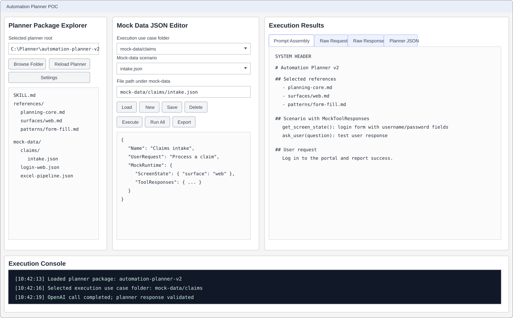
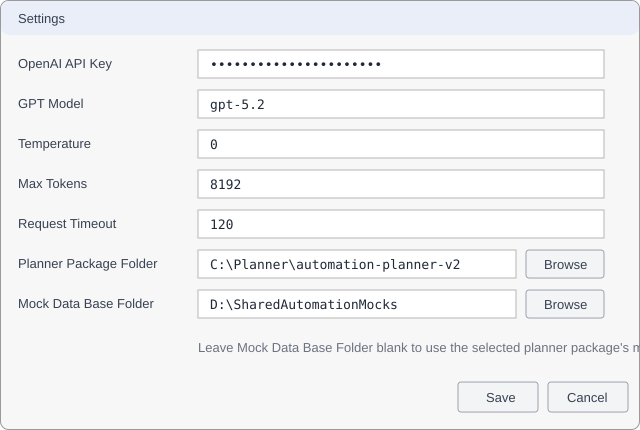

# Automation Planner POC

A .NET 8 WPF proof-of-concept that loads an Automation Planner skill package from disk and uses it as a dynamic prompt system for the OpenAI Responses API with the default `gpt-5.2` model.

## Projects

- `AutomationPlanner.POC` - WPF shell, main window, settings dialog, composition root.
- `AutomationPlanner.POC.Core` - provider-neutral interfaces.
- `AutomationPlanner.POC.Models` - planner package, planner contract, OpenAI request/response, settings, and validation models.
- `AutomationPlanner.POC.Services` - package loading, prompt assembly, validation, settings, export, and mock runtime services.
- `AutomationPlanner.POC.Infrastructure` - OpenAI Responses API provider implementation.
- `AutomationPlanner.POC.ViewModels` - MVVM view models and commands.
- `AutomationPlanner.POC.Views` - reserved project for reusable WPF controls/views.
- `AutomationPlanner.POC.Tests` - xUnit tests for core services.

## Setup

1. Install the .NET 8 SDK and a Windows environment capable of building WPF.
2. Open `AutomationPlanner.POC.sln` in Visual Studio 2022 or newer.
3. Set `AutomationPlanner.POC` as the startup project.
4. Run the application.
5. Open **Settings**, enter an OpenAI API key, set the planner package folder, optionally set a separate mock data base folder, and save.
6. Alternatively, use **Browse Folder** on the main window to select `automation-planner-v2`.
7. Click **Reload Planner**, select a scenario, click **Load Scenario**, then **Execute**.

Settings are saved locally under the current user's application data folder and API keys are never hardcoded in source.


## Screenshots

The documentation includes illustrative screenshots of the WPF shell to show the primary workflows before running the Windows desktop app.

### Main planner workspace



### Settings dialog



## Folder-driven planner packages

A planner package must contain:

```text
SKILL.md
references/
tests/
mock-data/
```

The loader recursively reads `references/**/*.md` and discovers scenarios from either the package `mock-data/**/*.json` folder or the configured external mock data base folder. Adding new planner packages, reference files, scenarios, or mock data does not require code changes.

## Planner package and mock data storage

The Settings screen has separate folder fields for the automation planner package and the mock data base folder. The planner package folder points to the directory containing `SKILL.md`, `references/`, and `tests/`. The mock data base folder points to the directory whose recursive JSON files should be treated as scenarios.

If Mock Data Base Folder is blank, mock data defaults to the selected planner package's `mock-data/` directory. For example, if the planner package is `C:\PlannerPackages\AutomationPlannerV2`, scenarios are discovered from `C:\PlannerPackages\AutomationPlannerV2\mock-data\**\*.json`. If Mock Data Base Folder is set to `D:\AutomationMocks`, scenarios are discovered from `D:\AutomationMocks\**\*.json` instead.

The app does not copy planner packages or mock data into AppData. AppData is used only for local user settings such as the selected planner package folder, mock data base folder, model name, timeout, and API key. If a team wants centrally managed mock data, place the mock data base folder in a shared repository or network folder and select that folder in the app.


## Mock tool responses

Mock automation tools are configured from each scenario's `MockRuntime` object. During execution, the app loads the selected scenario into `MockAutomationRuntime`, resolves the fake tool responses, and injects a `MockToolResponses` snapshot into the prompt scenario JSON so the planner can reason over the same data that the simulated tools would return.

Supported built-in mock tool keys are:

- `ScreenState` for `get_screen_state()`
- `ExcelStructure` for `get_excel_structure()`
- `CallableSignatures` for `get_callable_signatures()`
- `AskUserResponses` for `ask_user(question)`
- `ToolResponses` for additional named fake tool responses

## OpenAI integration

The OpenAI client posts strongly typed request models to `/v1/responses`, supports cancellation, retries transient failures, records request duration, token usage, raw request JSON, and raw response JSON.

## Exporting

The **Export** button writes prompt, raw request, raw response, planner JSON, and validation output to `Documents/AutomationPlannerExports/<timestamp>/`.

## Testing

On Windows with .NET 8 installed:

```powershell
dotnet restore AutomationPlanner.POC.sln
dotnet build AutomationPlanner.POC.sln
dotnet test AutomationPlanner.POC.Tests/AutomationPlanner.POC.Tests.csproj
```
